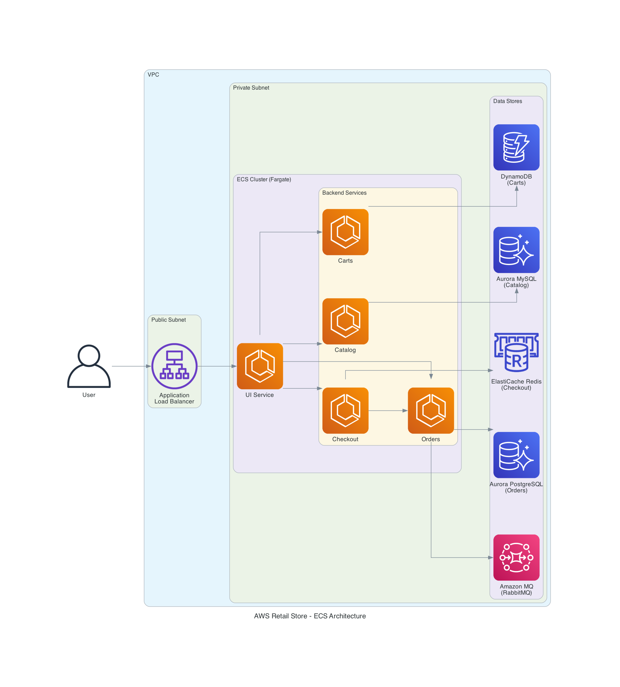

> ⚠️ **Disclaimer:** This repository includes intentional fault injection and stress test scenarios designed to demonstrate the AWS DevOps Agent's investigation capabilities. These scripts deliberately introduce issues such as memory leaks, network partitions, database stress, and service latency. **Do not run these scripts in production environments.** They are intended for learning and demonstration purposes only.
>
> 📦 **Source Code:** The source code for the Retail Store Sample Application can be found at: https://github.com/aws-containers/retail-store-sample-app

<div align="center">
  <strong>
  <h2>AWS DevOps Agent - ECS Troubleshooting Lab</h2>
  </strong>
  <p>A self-paced hands-on lab for learning ECS troubleshooting with AWS DevOps Agent</p>
</div>

---

## 📚 Index

| Section | Description |
|---------|-------------|
| [Overview](#overview) | Lab introduction and learning objectives |
| [Application Architecture](#application-architecture) | Microservices and infrastructure components |
| [Quick Start](#quick-start) | Deploy the infrastructure |
| [AWS DevOps Agent Setup](#aws-devops-agent-setup) | Configure the DevOps Agent |
| [Troubleshooting Labs](#troubleshooting-labs) | 10 hands-on labs |
| [Observability](#observability) | CloudWatch monitoring setup |
| [Cleanup](#cleanup) | Destroy resources |

---

## ⚠️ Important: Platform Requirements

> **The lab scripts (inject/fix) require a Linux/macOS bash environment.** 
>
> **Windows Users:** The fault injection scripts are shell scripts that will not run natively on Windows. You have two options:
> 1. **Recommended:** Use [AWS CloudShell](https://console.aws.amazon.com/cloudshell) - a browser-based shell with AWS CLI pre-installed
> 2. **Alternative:** Use WSL2 (Windows Subsystem for Linux), Git Bash, or SSH into a Linux EC2 instance
>
> Terraform commands can be run from any terminal (Windows PowerShell, CMD, or Linux/macOS).

---

## 🚀 Ready to Deploy?

If you're familiar with ECS and just want to get started:

```bash
git clone https://github.com/aws-samples/sample-devops-agent-ecs-workshop.git
cd sample-devops-agent-ecs-workshop/terraform/ecs/default
terraform init && terraform apply
```

**[Skip to Deployment →](#quick-start)**

---

## Overview

This lab provides a production-ready Amazon ECS deployment environment for learning how to troubleshoot containerized applications using **AWS DevOps Agent**. You'll deploy a multi-service retail store application, inject real faults, and use the DevOps Agent to investigate and resolve issues.

| Lab Information | Details |
|-----------------|---------|
| **Duration** | 2-3 hours |
| **Level** | 300 (Advanced) |
| **Target Audience** | DevOps Engineers, SREs, Platform Engineers |
| **Prerequisites** | Basic AWS knowledge, familiarity with containers |
| **Cost** | ~$3-4/hour (remember to clean up!) |

**This project is intended for educational purposes only and not for production use.**

## What You'll Learn

- Deploy a distributed microservices application to Amazon ECS using Terraform
- Configure AWS DevOps Agent to monitor your ECS infrastructure
- Execute chaos engineering experiments using fault injection
- Use DevOps Agent to investigate incidents and identify root causes
- Apply recommended mitigations to resolve issues

---

## Application Architecture

The lab deploys the **AWS Retail Store Sample Application**, a fully functional e-commerce application consisting of 5 microservices:



### Microservices

| Service | Language | Description | Backend |
|---------|----------|-------------|---------|
| **UI** | Java (Spring Boot) | Store frontend, serves web pages | Calls other services |
| **Catalog** | Go | Product catalog API | Aurora MySQL |
| **Cart** | Java (Spring Boot) | Shopping cart management | DynamoDB |
| **Checkout** | Node.js (NestJS) | Checkout orchestration | ElastiCache Redis |
| **Orders** | Java (Spring Boot) | Order processing | Aurora PostgreSQL + Amazon MQ |

> **Note:** This lab uses pre-built container images from Amazon ECR. The application source code is available in the [AWS Retail Store Sample App](https://github.com/aws-containers/retail-store-sample-app) repository.

### Infrastructure Components

| Category | Components |
|----------|------------|
| **Compute** | ECS Cluster (Fargate), 5 ECS Services, Application Load Balancer |
| **Data Stores** | Aurora MySQL (Catalog), Aurora PostgreSQL (Orders), DynamoDB (Cart), ElastiCache Redis (Checkout), Amazon MQ (Orders) |
| **Networking** | VPC with public/private subnets, NAT Gateway, Security Groups, ECS Service Connect |
| **Observability** | CloudWatch Container Insights (Enhanced), CloudWatch Logs, Alarms, Dashboard |

### Resource Tagging

All resources are tagged with `ecsdevopsagent=true` to enable AWS DevOps Agent discovery. This tag is applied to:
- ECS Cluster and Services
- RDS Database instances
- DynamoDB Tables
- ElastiCache clusters
- Application Load Balancer
- CloudWatch Log Groups
- IAM Roles
- Security Groups

---

## Quick Start

### Prerequisites

1. **Git** - [Installation guide](https://git-scm.com/downloads)
2. **AWS CLI** - Installed and configured with appropriate credentials ([Installation guide](https://docs.aws.amazon.com/cli/latest/userguide/getting-started-install.html))
3. **Terraform** >= 1.0 - [Installation guide](https://developer.hashicorp.com/terraform/tutorials/aws-get-started/install-cli)
4. **Session Manager Plugin** - Required for ECS Exec ([Installation guide](https://docs.aws.amazon.com/systems-manager/latest/userguide/session-manager-working-with-install-plugin.html))
5. **jq** - JSON processor for lab scripts ([Installation guide](https://jqlang.github.io/jq/download/))
6. **AWS Permissions** - **Administrator access recommended**. The lab creates multiple AWS resources (ECS, RDS, DynamoDB, ElastiCache, Amazon MQ, VPC, IAM roles, etc.). Using limited permissions may result in deployment failures.
7. **Bash Shell** (for lab scripts) - macOS/Linux terminal, [AWS CloudShell](https://console.aws.amazon.com/cloudshell), WSL2, or Git Bash on Windows

### Step 1: Clone the Repository

```bash
git clone https://github.com/aws-samples/sample-devops-agent-ecs-workshop.git
cd sample-devops-agent-ecs-workshop
```

### Step 2: Deploy Infrastructure

```bash
# Navigate to Terraform directory
cd terraform/ecs/default

# Initialize Terraform
terraform init

# Preview changes (optional)
terraform plan

# Deploy (~15-20 minutes)
terraform apply
# Type 'yes' when prompted
```

### Step 3: Verify Deployment

After Terraform completes, it displays output values including the application URL:

```
Outputs:

ecs_cluster_name = "retail-store-ecs-cluster"
ui_service_url = "http://retail-xxxxx.us-east-1.elb.amazonaws.com"
```

**Verify the application is running:**

1. Copy the `ui_service_url` from the Terraform output
2. Open it in your browser - you should see the Retail Store home page
3. Verify services in the [ECS Console](https://console.aws.amazon.com/ecs) → Clusters → `retail-store-ecs-cluster` → Services

You should see all 5 services running with 1/1 tasks:


**Optional: Verify via CLI (Linux/macOS/CloudShell only)**

```bash
# Get application URL
APP_URL=$(terraform output -raw ui_service_url)
echo "Application URL: $APP_URL"

# Test the application
curl -I $APP_URL

# Verify all services are running
aws ecs describe-services \
  --cluster $(terraform output -raw ecs_cluster_name) \
  --services ui catalog carts checkout orders \
  --query 'services[*].[serviceName,runningCount,desiredCount]' \
  --output table
```

### Step 4: Access the Application

Open the `APP_URL` in your browser. You should see the Retail Store home page.


Test the application by:
- **Home Page** - Featured products and categories
- **Catalog** - Browse all products (powered by Catalog service)
- **Cart** - Add/remove items (powered by Carts service)
- **Checkout** - Complete your purchase (powered by Checkout service)
- **Orders** - Order confirmation (powered by Orders service)

---

## AWS DevOps Agent Setup

AWS DevOps Agent is a frontier AI agent that helps accelerate incident response and improve system reliability. It investigates incidents and identifies operational improvements like an experienced DevOps engineer.

> **Note:** AWS DevOps Agent is currently in **public preview** and available in **US East (N. Virginia)** (`us-east-1`). The agent can monitor applications deployed in any AWS region.

### What is an Agent Space?

An **Agent Space** is a logical container that defines the tools and infrastructure that AWS DevOps Agent has access to. It represents the boundary of what the agent can access and investigate during incident response.

The agent uses a **dual-console architecture**:
- **AWS Management Console** - Administrators create and manage Agent Spaces, configure integrations, and set up access controls
- **DevOps Agent Web App** - Operations teams use this for day-to-day incident response, investigations, and viewing recommendations

### Step 1: Create an Agent Space

1. Navigate to the [AWS DevOps Agent Console](https://us-east-1.console.aws.amazon.com/aidevops/home?region=us-east-1)
2. Click **Begin setup** (or **Create Agent Space** if you have existing spaces)
3. Enter details:
   - **Name:** `retail-store-ecs-lab`
   - **Description:** Agent Space for ECS Troubleshooting Lab

### Step 2: Configure IAM Roles

1. In **Give this Agent Space AWS resource access**, select **Auto-create a new DevOps Agent role**
2. Review the permissions that will be granted to the role
3. (Optional) Customize the role name if desired

### Step 3: Configure Resource Discovery with Tags

Since this lab uses Terraform (not CloudFormation), you need to add a tag so the agent can discover your resources.

1. In the **Include AWS tags** section, click **Add tag**
2. Add tag: `ecsdevopsagent` = `true`

This tag enables the DevOps Agent to discover all lab resources including ECS cluster, services, RDS databases, DynamoDB tables, and related infrastructure.

### Step 4: Enable Web App Access

1. In **Enabling the Agent Space Web App**, select **Auto-create a new AWS DevOps Agent role**
2. Review the permissions that will be granted
3. Leave other settings as default
4. Click **Create**

### Step 5: Verify Setup

1. Wait 1-2 minutes for the Agent Space to be created
2. Click **Admin access** to open the Web App
3. Navigate to **DevOps Center** to view the discovered topology
4. Verify you can see the ECS cluster and services

You should see the following resources discovered:
- **ECS Cluster**: `retail-store-ecs-cluster`
- **ECS Services**: ui, catalog, cart, checkout, orders
- **RDS Instances**: catalog-db, orders-db
- **DynamoDB Table**: carts
- **ElastiCache**: checkout-redis
- **Amazon MQ**: RabbitMQ broker

### Verify Resource Discovery (Optional - CLI)

> **Note:** These commands require a bash shell (Linux/macOS/CloudShell)

```bash
# Verify ECS cluster tags
aws ecs describe-clusters --clusters retail-store-ecs-cluster \
  --query 'clusters[0].tags' --output table

# List all resources with the ecsdevopsagent tag
aws resourcegroupstaggingapi get-resources \
  --tag-filters Key=ecsdevopsagent,Values=true \
  --query 'ResourceTagMappingList[].ResourceARN' --output table
```

### Starting an Investigation

From the DevOps Agent Web App:

1. Click **Start Investigation**
2. Enter a prompt describing what you want to investigate:
   ```
   Check the health of my ECS services in the retail-store-ecs-cluster
   ```
3. Leave other options as default and click **Start Investigating**
4. The agent will analyze your infrastructure and provide insights

### Safety Mechanisms

| Mechanism | Description |
|-----------|-------------|
| **Read-Only by Default** | The agent only reads data; it does not modify resources |
| **Scoped Access** | Access is limited to resources within the Agent Space |
| **Audit Logging** | All agent actions are logged to CloudTrail |
| **Human-in-the-Loop** | Mitigation recommendations require human approval |

---

## Troubleshooting Labs

> **⚠️ Windows Users:** The lab scripts require a bash shell environment. Use one of these options:
> - **[AWS CloudShell](https://console.aws.amazon.com/cloudshell)** (Recommended) - Browser-based, no setup required
> - **WSL2** (Windows Subsystem for Linux)
> - **Git Bash** (comes with Git for Windows)
> - **SSH into a Linux EC2 instance**
>
> Before running lab scripts, ensure you have `jq` installed: `jq --version`

The labs are organized into two categories:

### Configuration Labs (Labs 1-6)

These labs focus on common ECS misconfigurations that cause service failures:

| Lab | Issue | Service | Difficulty |
|-----|-------|---------|------------|
| [Lab 1](#lab-1-cloudwatch-logs-not-delivered) | CloudWatch Logs Not Delivered | Catalog | Basic |
| [Lab 2](#lab-2-unable-to-pull-secrets) | Unable to Pull Secrets | Orders | Basic |
| [Lab 3](#lab-3-health-check-failures) | Health Check Failures | UI | Basic |
| [Lab 4](#lab-4-security-group-blocked) | Security Group Blocked (Database Connectivity) | Catalog → RDS | Intermediate |
| [Lab 5](#lab-5-task-resource-limits-oom) | Task Resource Limits (OOM) | Checkout | Intermediate |
| [Lab 6](#lab-6-service-connect-broken) | Service Connect Communication Broken | UI → Catalog | Intermediate |

### Performance Labs (Labs 7-10)

These labs inject real performance issues to simulate production incidents:

| Lab | Issue | Service | Difficulty |
|-----|-------|---------|------------|
| [Lab 7](#lab-7-cpu-stress) | CPU Stress | Catalog | Intermediate |
| [Lab 8](#lab-8-ddos-attack-simulation) | DDoS Attack Simulation | UI/ALB | Advanced |
| [Lab 9](#lab-9-dynamodb-attack) | DynamoDB Attack | Carts | Advanced |
| [Lab 10](#lab-10-auto-scaling-not-working) | Auto-Scaling Not Working | Catalog | Advanced |

### Lab Workflow

Each lab follows a consistent pattern:

```
┌─────────────────────┐     ┌─────────────────────┐     ┌─────────────────────┐
│  1. Inject Fault    │────▶│  2. Observe Symptoms│────▶│  3. Start           │
│  (run inject script)│     │  (check app/metrics)│     │  Investigation      │
└─────────────────────┘     └─────────────────────┘     └──────────┬──────────┘
                                                                   │
                                                                   ▼
┌─────────────────────┐     ┌─────────────────────┐     ┌─────────────────────┐
│  6. Rollback Fault  │◀────│  5. Apply Fix       │◀────│  4. Agent Analyzes  │
│  (run rollback      │     │  (follow agent      │     │  & Identifies Root  │
│   script)           │     │   recommendations)  │     │  Cause              │
└─────────────────────┘     └─────────────────────┘     └─────────────────────┘
```

---

### Lab 1: CloudWatch Logs Not Delivered

**Scenario:** The catalog service has stopped sending logs to CloudWatch. Without logs, you can't monitor the service's health or debug issues.

**Inject:**
```bash
./labs/lab1-logs-not-delivered/inject.sh
```

**Symptoms:**
- Catalog service tasks failing to start
- Service events showing `ResourceInitializationError`
- No new logs appearing in CloudWatch

**Try these investigation prompts:**

**Investigation details:**
```
Why is the catalog service failing to start new tasks in retail-store-ecs-cluster?
```

**Investigation starting point:**
```
Check the ECS service events for the catalog service in the retail-store-ecs-cluster. What is the stoppedReason for the failed catalog tasks?
```

**Root Cause:** Task definition references a non-existent CloudWatch log group.

**Fix:**
```bash
./labs/lab1-logs-not-delivered/fix.sh
```

---

### Lab 2: Unable to Pull Secrets

**Scenario:** The orders service can't start because it can't retrieve database credentials from Secrets Manager.

**Inject:**
```bash
./labs/lab2-secrets-access-denied/inject.sh
```

**Symptoms:**
- Orders service tasks fail to start
- Error: "unable to pull secrets or registry auth"
- Customers cannot place orders

**Try these investigation prompts:**

**Investigation details:**
```
Why is the orders service failing to start in retail-store-ecs-cluster?
```

**Investigation starting point:**
```
Check the stopped tasks for the orders service in retail-store-ecs-cluster and explain what is the issue.
```

**Root Cause:** Task execution role is missing `secretsmanager:GetSecretValue` permission.

**Fix:**
```bash
./labs/lab2-secrets-access-denied/fix.sh
```

---

### Lab 3: Health Check Failures

**Scenario:** The UI service tasks keep restarting every few minutes. Customers see intermittent 503 errors.

**Inject:**
```bash
./labs/lab3-health-check-failures/inject.sh
```

**Symptoms:**
- Tasks continuously restart
- Service never stabilizes
- Service events show "unhealthy" messages

**Try these investigation prompts:**

**Investigation details:**
```
Why does the UI service keep restarting tasks in retail-store-ecs-cluster?
```

**Investigation starting point:**
```
Investigate why UI service tasks are being replaced in retail-store-ecs-cluster. Check the health check configuration and service events for unhealthy task failures.
```

**Root Cause:** Health check path is misconfigured (`/wrong-health-endpoint` instead of `/actuator/health`).

**Fix:**
```bash
./labs/lab3-health-check-failures/fix.sh
```

---

### Lab 4: Security Group Blocked

**Scenario:** The product catalog stopped loading. The catalog service is running but returns errors when fetching products. Database connection timeouts appear in the logs.

**Inject:**
```bash
./labs/lab4-security-group-blocked/inject.sh
```

**Symptoms:**
- Catalog returns errors
- Service is running and healthy
- Database connection timeouts in logs
- RDS appears healthy

**Try these investigation prompts:**

**Investigation details:**
```
Why is catalog not working in retail-store-ecs-cluster?
```

**Investigation starting point:**
```
The catalog application is down in retail-store-ecs-cluster. Check the CloudWatch logs for database connection errors and investigate the networking configuration between ECS and RDS.
```

**Root Cause:** RDS security group is missing ingress rule allowing traffic from catalog service on port 3306.

**Fix:**
```bash
./labs/lab4-security-group-blocked/fix.sh
```

---

### Lab 5: Task Resource Limits (OOM)

**Scenario:** The checkout service is crashing repeatedly. Tasks start but crash within seconds due to memory exhaustion.

**Inject:**
```bash
./labs/lab5-task-resource-limits/inject.sh
```

**Symptoms:**
- Tasks crash shortly after starting
- Container shows `OutOfMemoryError: Container killed due to memory usage`
- Checkout unavailable - customers cannot complete purchases
- Rapid task cycling as ECS keeps trying to start new tasks

**Try these investigation prompts:**

**Investigation details:**
```
Why is the checkout service crashing in retail-store-ecs-cluster? The tasks keep restarting.
```

**Investigation starting point:**
```
Check the stopped checkout tasks in retail-store-ecs-cluster and explain why they crashed. Look for any indicators in the stopped task reasons.
```

**Root Cause:** A memory-stress sidecar container is consuming more memory than the task limit allows, causing OOM kills.

**Fix:**
```bash
./labs/lab5-task-resource-limits/fix.sh
```

---

### Lab 6: Service Connect Broken

**Scenario:** The UI loads but the product catalog is empty. The catalog service appears healthy but the UI can't communicate with it.

**Inject:**
```bash
./labs/lab6-service-connect-broken/inject.sh
```

**Symptoms:**
- UI loads but catalog is empty
- Catalog service is healthy
- UI logs show connection errors

**Try these investigation prompts:**

**Investigation details:**
```
The product catalog is empty but the catalog service in retail-store-ecs-cluster looks healthy. What's wrong?
```

**Investigation starting point:**
```
Show me the networking configuration for the services in retail-store-ecs-cluster. Check the UI service to identify any misconfiguration.
```

**Root Cause:** UI service environment variable points to wrong endpoint (`http://catalog-broken` instead of `http://catalog`).

**Fix:**
```bash
./labs/lab6-service-connect-broken/fix.sh
```

---

### Lab 7: CPU Stress

**Scenario:** Users report the product catalog is loading slowly. Page load times increased from under 1 second to 5-10 seconds.

**Inject:**
```bash
./labs/lab7-cpu-stress/inject.sh
```

**Symptoms:**
- Slow response times
- High CPU in Container Insights
- Service is running but slow

**Try these investigation prompts:**

**Investigation details:**
```
Why is catalog slow in retail-store-ecs-cluster?
```

**Investigation starting point:**
```
The catalog service is very slow in retail-store-ecs-cluster. Check the CPU utilization metrics and task definition to identify what is causing high CPU usage.
```

**Root Cause:** `stress-ng` process consuming CPU inside the container.

**Rollback:**
```bash
./labs/lab7-cpu-stress/rollback.sh
# Or wait 5 minutes for auto-rollback
```

---

### Lab 8: DDoS Attack Simulation

**Scenario:** The retail application is under attack! Users are reporting extremely slow page loads and timeouts. ALB metrics show a massive spike in request count - far beyond normal traffic levels.

**Inject:**
```bash
./labs/lab8-ddos-simulation/inject.sh
```

**Symptoms:**
- Slow page loads and timeouts
- ALB RequestCount through the roof (~300 req/s attack traffic)
- 5XX errors increasing
- Rogue ECS tasks running `http-flood-attack`

**Try these investigation prompts:**

**Investigation details:**
```
We're seeing a massive traffic spike on the retail application. What's causing this?
```

**Investigation starting point:**
```
Investigate the networking components like ALB metrics and target groups for retail-store-ecs-cluster. Then check all running tasks in the cluster.
```

**Root Cause:** Rogue ECS tasks flooding the ALB with HTTP requests using curl and GNU parallel.

**Rollback:**
```bash
./labs/lab8-ddos-simulation/fix.sh
```

---

### Lab 9: DynamoDB Attack

**Scenario:** The shopping cart service is completely broken. Users cannot add items to cart - all operations are failing with throttling errors. CloudWatch shows massive spikes in DynamoDB ThrottledRequests. This looks like a DDoS attack on the database!

**Inject:**
```bash
./labs/lab9-dynamodb-attack/inject.sh
```

**Symptoms:**
- Cart operations failing with throttling errors
- Massive ThrottledRequests spike in CloudWatch
- Rogue ECS tasks running `dynamodb-stress-attack`
- Service returning 500 errors

**Try these investigation prompts:**

**Investigation details:**
```
The shopping cart service is experiencing issues in retail-store-ecs-cluster. What's wrong?
```

**Investigation starting point:**
```
Check the DynamoDB metrics and CloudWatch logs for the carts service in retail-store-ecs-cluster. Also review all running tasks in the cluster.
```

**Root Cause:** Rogue ECS tasks flooding DynamoDB with scan requests. Table switched to low provisioned capacity (5 RCU) which is easily overwhelmed.

**Rollback:**
```bash
./labs/lab9-dynamodb-attack/fix.sh
```

---

### Lab 10: Auto-Scaling Not Working

**Scenario:** The catalog service is experiencing high CPU load during a traffic spike. Auto-scaling should kick in to add more tasks, but the service isn't scaling. Users are complaining about slow response times.

**Inject:**
```bash
./labs/lab10-autoscaling-broken/inject.sh
```

**Symptoms:**
- High CPU utilization visible in CloudWatch metrics
- CloudWatch alarm in ALARM state
- Service does NOT scale out (stays at current task count)
- Application becomes slow/unresponsive

**Try these investigation prompts:**

**Investigation details:**
```
Why isn't the catalog service scaling in retail-store-ecs-cluster?
```

**Investigation starting point:**
```
Check the Resource utilization for the catalog service in retail-store-ecs-cluster and review the ECS service auto-scaling configuration.
```

**Root Cause:** CloudWatch alarm actions are disabled, so even though the alarm fires, it doesn't trigger the scaling policy.

**Fix:**
```bash
./labs/lab10-autoscaling-broken/fix.sh
```

---

## Fault Injection Scenarios

The `labs/` directory contains all lab scripts organized by lab number:

| Lab | Inject Script | Fix Script | Target | Duration |
|-----|---------------|------------|--------|----------|
| Lab 7 | `labs/lab7-cpu-stress/inject.sh` | `labs/lab7-cpu-stress/fix.sh` | catalog | Until fixed |
| Lab 8 | `labs/lab8-ddos-simulation/inject.sh` | `labs/lab8-ddos-simulation/fix.sh` | ui/ALB | Until fixed |
| Lab 9 | `labs/lab9-dynamodb-attack/inject.sh` | `labs/lab9-dynamodb-attack/fix.sh` | carts | Until fixed |
| Lab 10 | `labs/lab10-autoscaling-broken/inject.sh` | `labs/lab10-autoscaling-broken/fix.sh` | catalog | Until fixed |

### Environment Variables

| Variable | Default | Description |
|----------|---------|-------------|
| `CLUSTER_NAME` | `retail-store-ecs-cluster` | ECS cluster name |
| `SERVICE_NAME` | varies | Target ECS service |
| `AWS_REGION` | `us-east-1` | AWS region |
| `STRESS_DURATION` | `300` | Duration in seconds |
| `CPU_WORKERS` | `2` | Number of CPU stress workers |
| `MEMORY_PERCENT` | `80` | Target memory percentage |
| `LATENCY_MS` | `500` | Network latency in milliseconds |

---

## Observability

The deployment includes production-grade observability to enable effective troubleshooting with AWS DevOps Agent:


### CloudWatch Container Insights (Enhanced)

Container Insights is enabled in **enhanced mode**, providing:
- **CPU and memory utilization** per service and task
- **Network I/O metrics** for traffic analysis
- **Running task counts** for availability monitoring
- **Performance metrics** at container level

### CloudWatch Logs

All ECS tasks send application logs to CloudWatch Logs:
- Each service has its own log stream for easy isolation
- Configurable retention (default: 30 days)
- ECS Exec session logging for audit trails
- Optional KMS encryption

### CloudWatch Alarms

When `cloudwatch_alarms_enabled = true` (default), pre-configured alarms monitor:
- **CPU utilization** > 80% per service
- **Memory utilization** > 80% per service
- **Running task count** < 1 (service down)
- **ALB 5XX errors** spike detection
- **ALB latency** p95 > 2 seconds

### CloudWatch Dashboard

A unified dashboard displays service health, resource utilization, ALB metrics, and error rates:

```bash
terraform output cloudwatch_dashboard_url
```

This observability stack provides AWS DevOps Agent with the data it needs to correlate symptoms, identify root causes, and recommend mitigations during incidents.

---

## Cleanup

**Important:** Remember to destroy all resources to avoid ongoing charges!

### Option 1: Use the Destroy Script (Recommended)

The destroy script handles all dependencies automatically, ensuring a clean one-shot destruction:

```bash
./scripts/destroy.sh
```

This script will:
1. Scale down and delete all ECS services
2. Delete Load Balancers
3. Delete VPC Endpoints (common blocker for subnet deletion)
4. Delete NAT Gateways
5. Clean up orphaned network interfaces
6. Remove any terraform state locks
7. Run `terraform destroy`

### Option 2: Manual Destruction

If you prefer manual control:

#### Step 1: Restore Lab Configurations

If you have any active lab faults, restore them first:
```bash
# Run fix scripts for any active labs
./labs/lab1-logs-not-delivered/fix.sh
./labs/lab2-secrets-access-denied/fix.sh
# ... etc
```

#### Step 2: Destroy Infrastructure

```bash
cd terraform/ecs/default
terraform destroy
# Type 'yes' when prompted
```

Destruction takes ~10-15 minutes.

#### Troubleshooting Destroy Failures

If `terraform destroy` fails with `DependencyViolation` errors on subnets, there are likely resources still using them:

```bash
# Find what's blocking subnet deletion
aws ec2 describe-network-interfaces \
  --filters "Name=subnet-id,Values=<subnet-id>" \
  --query "NetworkInterfaces[*].{ID:NetworkInterfaceId,Type:InterfaceType,Description:Description}"

# Common blockers are VPC Endpoints - delete them first
aws ec2 describe-vpc-endpoints --filters "Name=vpc-id,Values=<vpc-id>" --query 'VpcEndpoints[*].VpcEndpointId'
aws ec2 delete-vpc-endpoints --vpc-endpoint-ids <endpoint-id>

# Then retry terraform destroy
terraform destroy
```

If you get a state lock error:
```bash
# Force unlock (use the lock ID from the error message)
terraform force-unlock <lock-id>

# Or remove the lock file for local state
rm -f .terraform.tfstate.lock.info
```

### Step 3: Delete DevOps Agent Space (Optional)

1. Navigate to [AWS DevOps Agent Console](https://us-east-1.console.aws.amazon.com/aidevops/home?region=us-east-1)
2. Select your Agent Space
3. Click **Delete** and confirm

---

## Additional Resources

- [AWS DevOps Agent Documentation](https://docs.aws.amazon.com/devopsagent/latest/userguide/about-aws-devops-agent.html)
- [Amazon ECS Documentation](https://docs.aws.amazon.com/ecs/)
- [CloudWatch Container Insights](https://docs.aws.amazon.com/AmazonCloudWatch/latest/monitoring/ContainerInsights.html)
- [ECS Exec Documentation](https://docs.aws.amazon.com/AmazonECS/latest/developerguide/ecs-exec.html)

---

## Contributing

See [CONTRIBUTING.md](./CONTRIBUTING.md) for guidelines.

## License

This project is licensed under the MIT-0 License. See [LICENSE](./LICENSE) for details.
