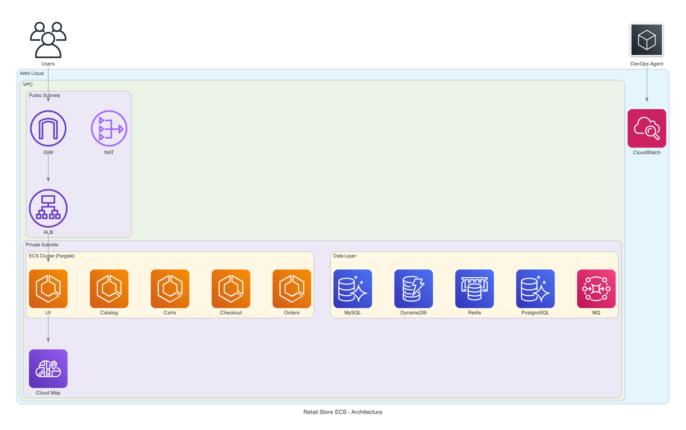
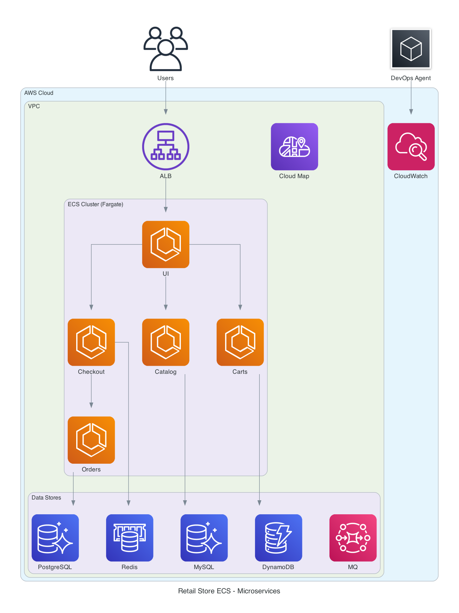
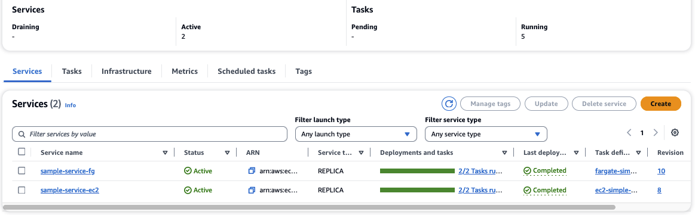
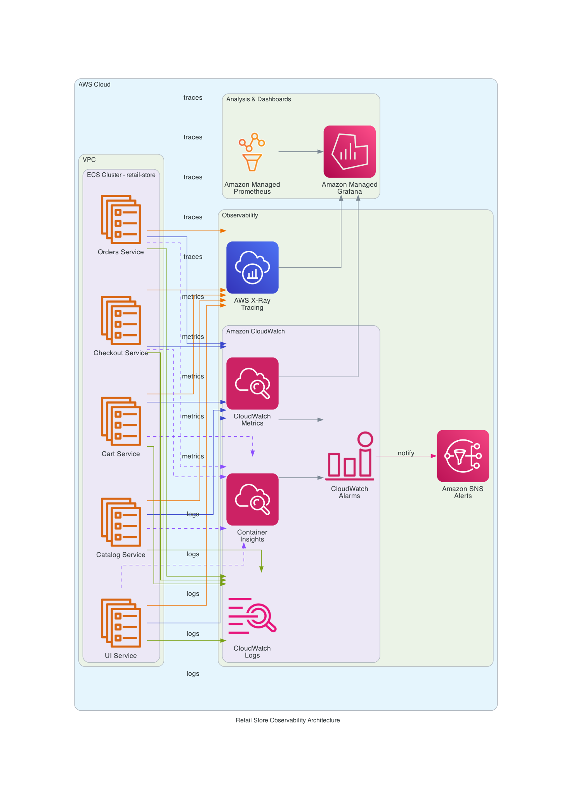

<div align="center">
  <strong>
  <h2>AWS DevOps Agent - ECS Troubleshooting Lab</h2>
  </strong>
  <p>A self-paced hands-on lab for learning ECS troubleshooting with AWS DevOps Agent</p>
</div>

---

## 📚 Index

| Section | Description |
|---------|-------------|
| [Overview](#overview) | Lab introduction and learning objectives |
| [Application Architecture](#application-architecture) | Microservices and infrastructure components |
| [Quick Start](#quick-start) | Deploy the infrastructure |
| [AWS DevOps Agent Setup](#aws-devops-agent-setup) | Configure the DevOps Agent |
| [Troubleshooting Labs](#troubleshooting-labs) | 10 hands-on labs |
| [Observability](#observability) | CloudWatch monitoring setup |
| [Cleanup](#cleanup) | Destroy resources |

---

## 🚀 Ready to Deploy?

If you're familiar with ECS and just want to get started:

```bash
git clone https://github.com/aws-samples/devops-agent-ecs.git
cd devops-agent-ecs/terraform/ecs/default
terraform init && terraform apply
```

**[Skip to Deployment →](#quick-start)**

---

## Overview

This lab provides a production-ready Amazon ECS deployment environment for learning how to troubleshoot containerized applications using **AWS DevOps Agent**. You'll deploy a multi-service retail store application, inject real faults, and use the DevOps Agent to investigate and resolve issues.

| Lab Information | Details |
|-----------------|---------|
| **Duration** | 2-3 hours |
| **Level** | 300 (Advanced) |
| **Target Audience** | DevOps Engineers, SREs, Platform Engineers |
| **Prerequisites** | Basic AWS knowledge, familiarity with containers |
| **Cost** | ~$3-4/hour (remember to clean up!) |

**This project is intended for educational purposes only and not for production use.**

## What You'll Learn

- Deploy a distributed microservices application to Amazon ECS using Terraform
- Configure AWS DevOps Agent to monitor your ECS infrastructure
- Execute chaos engineering experiments using fault injection
- Use DevOps Agent to investigate incidents and identify root causes
- Apply recommended mitigations to resolve issues

---

## Application Architecture

The lab deploys the **AWS Retail Store Sample Application**, a fully functional e-commerce application consisting of 5 microservices:



### Microservices Overview



### Microservices

| Service | Language | Description | Backend |
|---------|----------|-------------|---------|
| **UI** | Java (Spring Boot) | Store frontend, serves web pages | Calls other services |
| **Catalog** | Go | Product catalog API | RDS MariaDB |
| **Cart** | Java (Spring Boot) | Shopping cart management | DynamoDB |
| **Checkout** | Node.js (NestJS) | Checkout orchestration | ElastiCache Redis |
| **Orders** | Java (Spring Boot) | Order processing | RDS MariaDB + Amazon MQ |

> **Note:** This lab uses pre-built container images from Amazon ECR. The application source code is available in the [AWS Retail Store Sample App](https://github.com/aws-containers/retail-store-sample-app) repository.

### Infrastructure Components

| Category | Components |
|----------|------------|
| **Compute** | ECS Cluster (Fargate), 5 ECS Services, Application Load Balancer |
| **Data Stores** | RDS MariaDB (Catalog, Orders), DynamoDB (Cart), ElastiCache Redis (Checkout), Amazon MQ (Orders) |
| **Networking** | VPC with public/private subnets, NAT Gateway, Security Groups, ECS Service Connect |
| **Observability** | CloudWatch Container Insights (Enhanced), CloudWatch Logs, Alarms, Dashboard |

### Resource Tagging

All resources are tagged with `ecsdevopsagent=true` to enable AWS DevOps Agent discovery. This tag is applied to:
- ECS Cluster and Services
- RDS Database instances
- DynamoDB Tables
- ElastiCache clusters
- Application Load Balancer
- CloudWatch Log Groups
- IAM Roles
- Security Groups

---

## Quick Start

### Prerequisites

1. **AWS CLI** - Installed and configured with appropriate credentials
2. **Terraform** >= 1.0 - [Installation guide](https://developer.hashicorp.com/terraform/tutorials/aws-get-started/install-cli)
3. **Session Manager Plugin** - Required for ECS Exec ([Installation guide](https://docs.aws.amazon.com/systems-manager/latest/userguide/session-manager-working-with-install-plugin.html))
4. **AWS Permissions** - Administrator access or permissions for ECS, EC2, RDS, DynamoDB, ElastiCache, Amazon MQ, CloudWatch, IAM, ALB

### Step 1: Clone the Repository

```bash
git clone https://github.com/aws-samples/devops-agent-ecs.git
cd devops-agent-ecs
```

### Step 2: Deploy Infrastructure

```bash
# Navigate to Terraform directory
cd terraform/ecs/default

# Initialize Terraform
terraform init

# Preview changes (optional)
terraform plan

# Deploy (~15-20 minutes)
terraform apply
# Type 'yes' when prompted
```

### Step 3: Verify Deployment

```bash
# Get application URL
export APP_URL=$(terraform output -raw ui_service_url)
echo "Application URL: $APP_URL"

# Test the application
curl -I $APP_URL

# Verify all services are running
aws ecs describe-services \
  --cluster $(terraform output -raw ecs_cluster_name) \
  --services ui catalog carts checkout orders \
  --query 'services[*].[serviceName,runningCount,desiredCount]' \
  --output table
```

You should see all 5 services running:



### Step 4: Access the Application

Open the `APP_URL` in your browser. You should see the Retail Store home page.


Test the application by:
- **Home Page** - Featured products and categories
- **Catalog** - Browse all products (powered by Catalog service)
- **Cart** - Add/remove items (powered by Carts service)
- **Checkout** - Complete your purchase (powered by Checkout service)
- **Orders** - Order confirmation (powered by Orders service)

> **Tip:** Keep this URL handy - you'll use it throughout the troubleshooting labs to observe the impact of injected faults.

---

## AWS DevOps Agent Setup

AWS DevOps Agent is a frontier AI agent that helps accelerate incident response and improve system reliability. It investigates incidents and identifies operational improvements like an experienced DevOps engineer.

> **Note:** AWS DevOps Agent is currently in **public preview** and available in **US East (N. Virginia)** (`us-east-1`). The agent can monitor applications deployed in any AWS region.

### What is an Agent Space?

An **Agent Space** is a logical container that defines the tools and infrastructure that AWS DevOps Agent has access to. It represents the boundary of what the agent can access and investigate during incident response.

The agent uses a **dual-console architecture**:
- **AWS Management Console** - Administrators create and manage Agent Spaces, configure integrations, and set up access controls
- **DevOps Agent Web App** - Operations teams use this for day-to-day incident response, investigations, and viewing recommendations

### Step 1: Create an Agent Space

1. Navigate to the [AWS DevOps Agent Console](https://console.aws.amazon.com/devops-agent/home?region=us-east-1)
2. Click **Create Agent Space**
3. Enter details:
   - **Name:** `retail-store-ecs-lab`
   - **Description:** Agent Space for ECS Troubleshooting Lab

### Step 2: Configure IAM Roles

1. In **Give this Agent Space AWS resource access**, select **Auto-create a new AWS DevOps Agent role**
2. Click **Next**

### Step 3: Configure Resource Discovery

1. In **Using AWS tags for resource discovery**, click **Add tag**
2. Add tag: `ecsdevopsagent` = `true`

This tag enables the DevOps Agent to discover all lab resources including ECS cluster, services, RDS databases, DynamoDB tables, and related infrastructure.

### Step 4: Enable Web App

1. In **Enabling the Agent Space Web App**, select **Enable**
2. Select **Auto-create a new AWS DevOps Agent role**
3. Click **Submit**

### Step 5: Verify Setup

1. Wait 1-2 minutes for the Agent Space to be created
2. Click **Admin access** to open the Web App
3. Navigate to **DevOps Center** to view the discovered topology
4. Verify you can see the ECS cluster and services

You should see the following resources discovered:
- **ECS Cluster**: `retail-store-ecs-cluster`
- **ECS Services**: ui, catalog, cart, checkout, orders
- **RDS Instances**: catalog-db, orders-db
- **DynamoDB Table**: carts
- **ElastiCache**: checkout-redis
- **Amazon MQ**: RabbitMQ broker

### Verify Resource Discovery

```bash
# Verify ECS cluster tags
aws ecs describe-clusters --clusters retail-store-ecs-cluster \
  --query 'clusters[0].tags' --output table

# List all resources with the ecsdevopsagent tag
aws resourcegroupstaggingapi get-resources \
  --tag-filters Key=ecsdevopsagent,Values=true \
  --query 'ResourceTagMappingList[].ResourceARN' --output table
```

### Starting an Investigation

From the DevOps Agent Web App:

1. Click **Start Investigation**
2. Enter a prompt describing what you want to investigate:
   ```
   Check the health of my ECS services in the retail-store-ecs-cluster
   ```
3. The agent will analyze your infrastructure and provide insights

### Safety Mechanisms

| Mechanism | Description |
|-----------|-------------|
| **Read-Only by Default** | The agent only reads data; it does not modify resources |
| **Scoped Access** | Access is limited to resources within the Agent Space |
| **Audit Logging** | All agent actions are logged to CloudTrail |
| **Human-in-the-Loop** | Mitigation recommendations require human approval |

---

## Troubleshooting Labs

The labs are organized into two categories:

### Configuration Labs (Labs 1-6)

These labs focus on common ECS misconfigurations that cause service failures:

| Lab | Issue | Service | Difficulty |
|-----|-------|---------|------------|
| [Lab 1](#lab-1-cloudwatch-logs-not-delivered) | CloudWatch Logs Not Delivered | Catalog | Basic |
| [Lab 2](#lab-2-unable-to-pull-secrets) | Unable to Pull Secrets | Orders | Basic |
| [Lab 3](#lab-3-health-check-failures) | Health Check Failures | UI | Basic |
| [Lab 4](#lab-4-service-connect-broken) | Service Connect Communication Broken | UI | Intermediate |
| [Lab 5](#lab-5-task-resource-limits-oom) | Task Resource Limits (OOM) | Checkout | Intermediate |
| [Lab 6](#lab-6-security-group-blocked) | Security Group Blocked | Catalog → RDS | Intermediate |

### Performance Labs (Labs 7-10)

These labs inject real performance issues to simulate production incidents:

| Lab | Issue | Service | Difficulty |
|-----|-------|---------|------------|
| [Lab 7](#lab-7-cpu-stress) | CPU Stress | Catalog | Intermediate |
| [Lab 8](#lab-8-memory-stress) | Memory Stress | Carts | Intermediate |
| [Lab 9](#lab-9-dynamodb-latency) | DynamoDB Latency | Carts | Advanced |
| [Lab 10](#lab-10-rds-stress) | RDS Stress | Catalog | Advanced |

### Lab Workflow

Each lab follows a consistent pattern:

```
┌─────────────────────┐     ┌─────────────────────┐     ┌─────────────────────┐
│  1. Inject Fault    │────▶│  2. Observe Symptoms│────▶│  3. Start           │
│  (run inject script)│     │  (check app/metrics)│     │  Investigation      │
└─────────────────────┘     └─────────────────────┘     └──────────┬──────────┘
                                                                   │
                                                                   ▼
┌─────────────────────┐     ┌─────────────────────┐     ┌─────────────────────┐
│  6. Rollback Fault  │◀────│  5. Apply Fix       │◀────│  4. Agent Analyzes  │
│  (run rollback      │     │  (follow agent      │     │  & Identifies Root  │
│   script)           │     │   recommendations)  │     │  Cause              │
└─────────────────────┘     └─────────────────────┘     └─────────────────────┘
```

---

### Lab 1: CloudWatch Logs Not Delivered

**Scenario:** The catalog service has stopped sending logs to CloudWatch. Without logs, you can't monitor the service's health or debug issues.

**Inject:**
```bash
./labs/lab1-logs-not-delivered/inject.sh
```

**Symptoms:**
- Catalog service tasks failing to start
- Service events showing `ResourceInitializationError`
- No new logs appearing in CloudWatch

**Investigation Prompts:**
```
Why is the catalog service failing to start new tasks?
```
```
Check the ECS service events for the catalog service
```

**Root Cause:** Task definition references a non-existent CloudWatch log group.

**Fix:**
```bash
./labs/lab1-logs-not-delivered/fix.sh
```

---

### Lab 2: Unable to Pull Secrets

**Scenario:** The orders service can't start because it can't retrieve database credentials from Secrets Manager.

**Inject:**
```bash
./labs/lab2-secrets-access-denied/inject.sh
```

**Symptoms:**
- Orders service tasks fail to start
- Error: "unable to pull secrets or registry auth"
- Customers cannot place orders

**Investigation Prompts:**
```
Why is the orders service failing to start?
```
```
What IAM permissions does the orders service task execution role have?
```

**Root Cause:** Task execution role is missing `secretsmanager:GetSecretValue` permission.

**Fix:**
```bash
./labs/lab2-secrets-access-denied/fix.sh
```

---

### Lab 3: Health Check Failures

**Scenario:** The UI service tasks keep restarting every few minutes. Customers see intermittent 503 errors.

**Inject:**
```bash
./labs/lab3-health-check-failures/inject.sh
```

**Symptoms:**
- Tasks continuously restart
- Service never stabilizes
- Service events show "unhealthy" messages

**Investigation Prompts:**
```
Why does the UI service keep restarting tasks?
```
```
What health check configuration is the UI service using?
```

**Root Cause:** Health check path is misconfigured (`/wrong-health-endpoint` instead of `/actuator/health`).

**Fix:**
```bash
./labs/lab3-health-check-failures/fix.sh
```

---

### Lab 4: Service Connect Broken

**Scenario:** The UI loads but the product catalog is empty. The catalog service appears healthy but the UI can't communicate with it.

**Inject:**
```bash
./labs/lab4-service-discovery-broken/inject.sh
```

**Symptoms:**
- UI loads but catalog is empty
- Catalog service is healthy
- UI logs show connection errors

**Investigation Prompts:**
```
The product catalog is empty but the catalog service looks healthy. What's wrong?
```
```
How does the UI service connect to the catalog service?
```

**Root Cause:** UI service environment variable points to wrong endpoint (`http://catalog-broken` instead of `http://catalog`).

**Fix:**
```bash
./labs/lab4-service-discovery-broken/fix.sh
```

---

### Lab 5: Task Resource Limits (OOM)

**Scenario:** The checkout service is crashing repeatedly. Tasks start but crash within seconds with exit code 137.

**Inject:**
```bash
./labs/lab5-task-resource-limits/inject.sh
```

**Symptoms:**
- Tasks crash immediately
- Exit code 137 (OOM kill)
- Checkout unavailable

**Investigation Prompts:**
```
Why is the checkout service crashing? The tasks keep restarting.
```
```
What's the exit code for the stopped checkout tasks?
```

**Root Cause:** Memory limit set too low (128MB instead of 2048MB). Exit code 137 = 128 + 9 (SIGKILL from OOM).

**Fix:**
```bash
./labs/lab5-task-resource-limits/fix.sh
```

---

### Lab 6: Security Group Blocked

**Scenario:** The product catalog stopped loading. The catalog service is running but returns errors when fetching products.

**Inject:**
```bash
./labs/lab6-security-group-blocked/inject.sh
```

**Symptoms:**
- Catalog returns errors
- Service is running and healthy
- Database connection timeouts in logs
- RDS appears healthy

**Investigation Prompts:**
```
The catalog service can't connect to the database. What's wrong?
```
```
What security groups are attached to the catalog service and the RDS database?
```

**Root Cause:** RDS security group is missing ingress rule allowing traffic from catalog service on port 3306.

**Fix:**
```bash
./labs/lab6-security-group-blocked/fix.sh
```

---

### Lab 7: CPU Stress

**Scenario:** Users report the product catalog is loading slowly. Page load times increased from under 1 second to 5-10 seconds.

**Inject:**
```bash
./labs/lab7-cpu-stress/inject.sh
```

**Symptoms:**
- Slow response times
- High CPU in Container Insights
- Service is running but slow

**Investigation Prompts:**
```
The catalog service is slow. Is there high CPU utilization?
```
```
Show me the CPU metrics for the catalog service from Container Insights
```

**Root Cause:** `stress-ng` process consuming CPU inside the container.

**Rollback:**
```bash
./labs/lab7-cpu-stress/rollback.sh
# Or wait 5 minutes for auto-rollback
```

---

### Lab 8: Memory Stress

**Scenario:** The shopping cart service is experiencing intermittent failures. Users report losing items from their carts.

**Inject:**
```bash
./labs/lab8-memory-stress/inject.sh
```

**Symptoms:**
- High memory utilization
- Potential OOM kills (exit code 137)
- Intermittent cart failures

**Investigation Prompts:**
```
The carts service seems unstable. Is there a memory issue?
```
```
Are there any OOM killed tasks for the carts service?
```

**Root Cause:** `stress-ng` memory workers consuming ~80% of available memory.

**Rollback:**
```bash
./labs/lab8-memory-stress/rollback.sh
# Or wait 5 minutes for auto-rollback
```

---

### Lab 9: DynamoDB Latency

**Scenario:** The shopping cart is extremely slow. Adding or removing items takes several seconds instead of milliseconds.

**Inject:**
```bash
./labs/lab9-dynamodb-latency/inject.sh
```

**Symptoms:**
- Slow cart operations
- High DynamoDB latency in CloudWatch
- Service is healthy but slow

**Investigation Prompts:**
```
Cart operations are very slow. Is there a DynamoDB latency issue?
```
```
Show me the DynamoDB latency metrics for the carts table
```

**Root Cause:** Network latency (500ms) added to DynamoDB traffic using Linux traffic control (`tc`).

**Rollback:**
```bash
./labs/lab9-dynamodb-latency/rollback.sh
# Or wait 5 minutes for auto-rollback
```

---

### Lab 10: RDS Stress

**Scenario:** The catalog service is experiencing intermittent slowdowns and timeouts. The RDS database seems to be under heavy load.

**Inject:**
```bash
./labs/lab10-rds-stress/inject.sh
```

**Symptoms:**
- Slow and inconsistent response times
- High RDS CPU
- Query timeouts

**Investigation Prompts:**
```
The catalog service is slow and inconsistent. Is the database under stress?
```
```
Show me the RDS CPU utilization and database connections metrics
```

**Root Cause:** Heavy, inefficient queries (ORDER BY RAND(), cross joins) consuming database resources.

**Rollback:**
```bash
# Stress auto-stops after 2 minutes
```

---

## Fault Injection Scenarios

The `labs/` directory contains all lab scripts organized by lab number:

| Lab | Inject Script | Rollback Script | Target | Duration |
|-----|---------------|-----------------|--------|----------|
| Lab 7 | `labs/lab7-cpu-stress/inject.sh` | `labs/lab7-cpu-stress/rollback.sh` | catalog | 5 min |
| Lab 8 | `labs/lab8-memory-stress/inject.sh` | `labs/lab8-memory-stress/rollback.sh` | carts | 5 min |
| Lab 9 | `labs/lab9-dynamodb-latency/inject.sh` | `labs/lab9-dynamodb-latency/rollback.sh` | carts | 5 min |
| Lab 10 | `labs/lab10-rds-stress/inject.sh` | (auto-terminates) | catalog | 2 min |

### Environment Variables

| Variable | Default | Description |
|----------|---------|-------------|
| `CLUSTER_NAME` | `retail-store-ecs-cluster` | ECS cluster name |
| `SERVICE_NAME` | varies | Target ECS service |
| `AWS_REGION` | `us-east-1` | AWS region |
| `STRESS_DURATION` | `300` | Duration in seconds |
| `CPU_WORKERS` | `2` | Number of CPU stress workers |
| `MEMORY_PERCENT` | `80` | Target memory percentage |
| `LATENCY_MS` | `500` | Network latency in milliseconds |

---

## Observability

The deployment includes production-grade observability to enable effective troubleshooting with AWS DevOps Agent:



### CloudWatch Container Insights (Enhanced)

Container Insights is enabled in **enhanced mode**, providing:
- **CPU and memory utilization** per service and task
- **Network I/O metrics** for traffic analysis
- **Running task counts** for availability monitoring
- **Performance metrics** at container level

### CloudWatch Logs

All ECS tasks send application logs to CloudWatch Logs:
- Each service has its own log stream for easy isolation
- Configurable retention (default: 30 days)
- ECS Exec session logging for audit trails
- Optional KMS encryption

### CloudWatch Alarms

When `cloudwatch_alarms_enabled = true` (default), pre-configured alarms monitor:
- **CPU utilization** > 80% per service
- **Memory utilization** > 80% per service
- **Running task count** < 1 (service down)
- **ALB 5XX errors** spike detection
- **ALB latency** p95 > 2 seconds

### CloudWatch Dashboard

A unified dashboard displays service health, resource utilization, ALB metrics, and error rates:

```bash
terraform output cloudwatch_dashboard_url
```

This observability stack provides AWS DevOps Agent with the data it needs to correlate symptoms, identify root causes, and recommend mitigations during incidents.

---

## Cleanup

**Important:** Remember to destroy all resources to avoid ongoing charges!

### Step 1: Restore Lab Configurations

If you have any active lab faults, restore them first:
```bash
# Run fix scripts for any active labs
./labs/lab1-logs-not-delivered/fix.sh
./labs/lab2-secrets-access-denied/fix.sh
# ... etc
```

### Step 2: Destroy Infrastructure

```bash
cd terraform/ecs/default
terraform destroy
# Type 'yes' when prompted
```

Destruction takes ~10-15 minutes.

### Step 3: Delete DevOps Agent Space (Optional)

1. Navigate to [AWS DevOps Agent Console](https://console.aws.amazon.com/devops-agent/home?region=us-east-1)
2. Select your Agent Space
3. Click **Delete** and confirm

---

## Additional Resources

- [AWS DevOps Agent Documentation](https://docs.aws.amazon.com/devopsagent/latest/userguide/about-aws-devops-agent.html)
- [Amazon ECS Documentation](https://docs.aws.amazon.com/ecs/)
- [CloudWatch Container Insights](https://docs.aws.amazon.com/AmazonCloudWatch/latest/monitoring/ContainerInsights.html)
- [ECS Exec Documentation](https://docs.aws.amazon.com/AmazonECS/latest/developerguide/ecs-exec.html)

---

## Contributing

See [CONTRIBUTING.md](./CONTRIBUTING.md) for guidelines.

## License

This project is licensed under the MIT-0 License. See [LICENSE](./LICENSE) for details.
